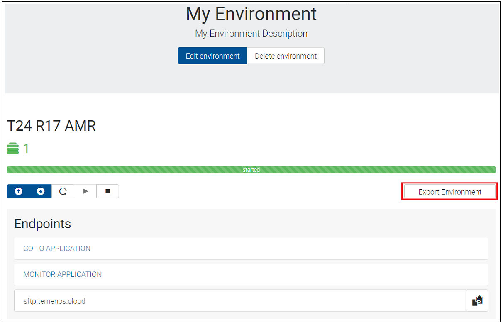
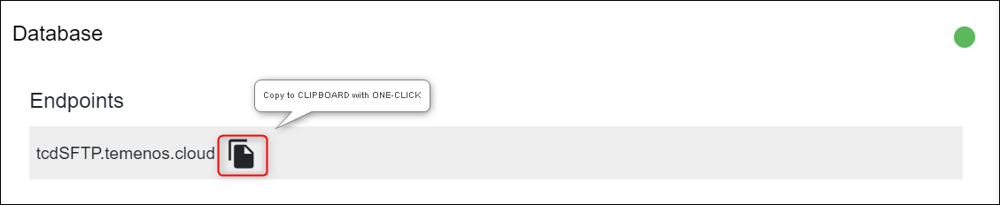
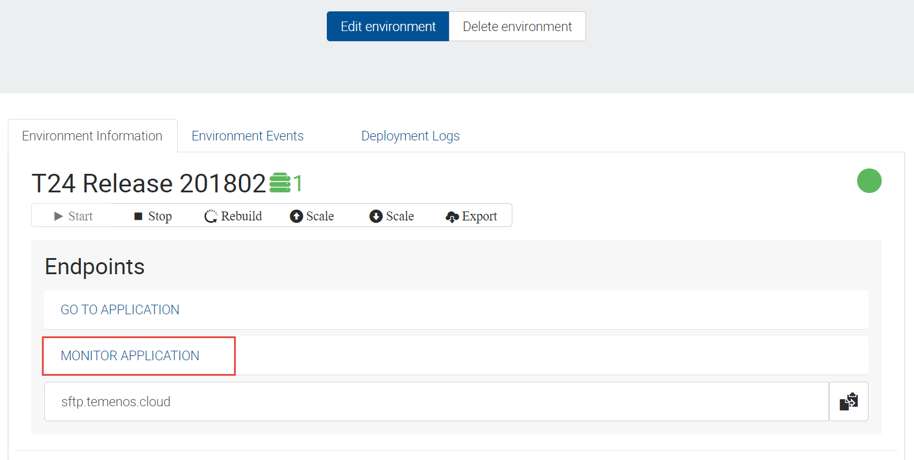
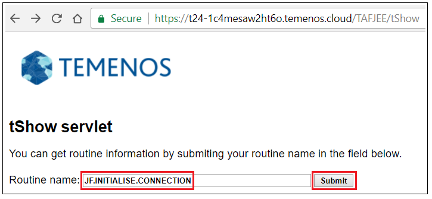
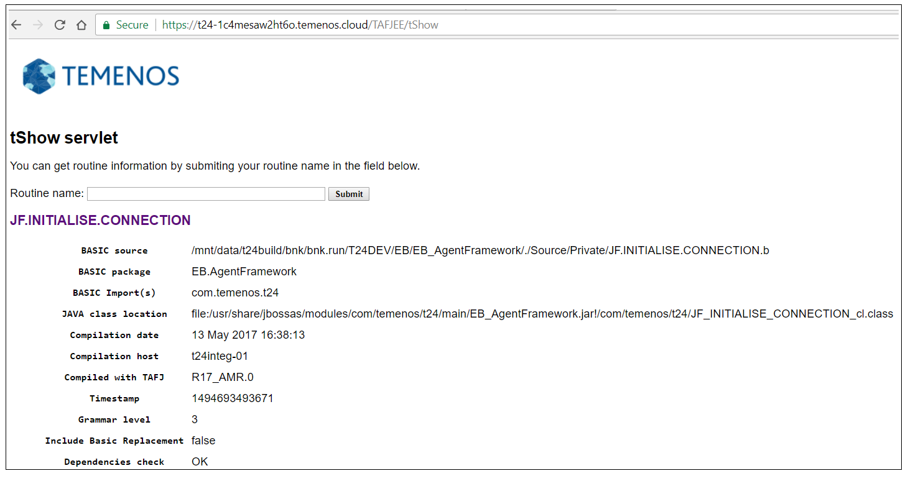
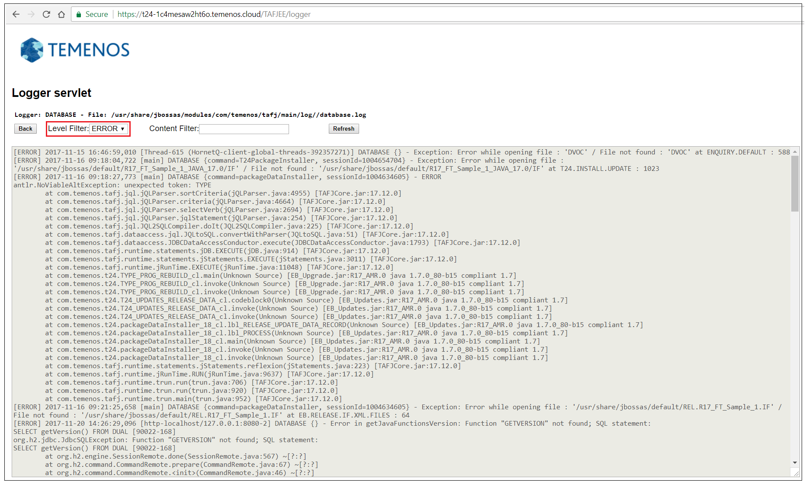
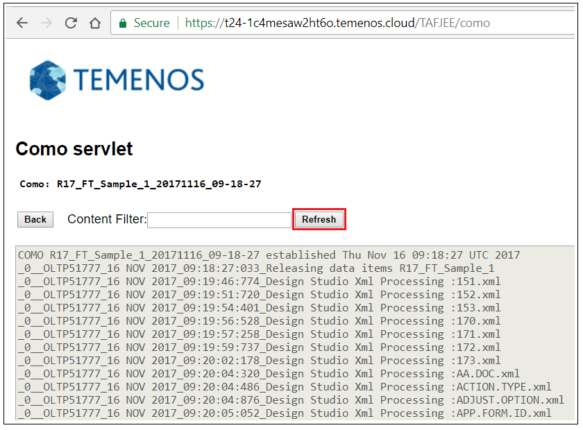
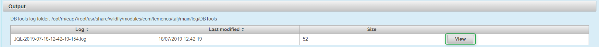

## Introduction ##
 
This user guide shows different ways of accessing details related to your development environment when deploying the following:  

- Design Studio Packages
- Plugins
- Updates
- WAR files

# 1. Export Environment Details #

The Export Environment Details functionality gives you access to different information related to your sandbox like:  
-> the _T24 UD (default)_ folder from your T24 sandbox  
-> the _jars_ deployed in your T24 sandbox  
-> the _war_ files deployed(with success or not) in your T24 sandbox  
-> the jboss _server.log_ from your T24 sandbox.  

The environment details are exported in a SFTP server to which you have to connect in order to download the related files in your local machine. For this purpose, make sure you [download](https://winscp.net/download/WinSCP-5.11.2-Setup.exe) and install WinSCP SFTP client.  

The Export Environment Details functionality can be triggered from PaaS Portal following the bellow steps:  
* Log-in to your organisation in PaaS Portal, go to your enviroment page and click on the **Export Environment** button for the T24 application.  
  
* After click, the **Export Environment** button will become disabled(as per bellow picture), meaning that the export was triggered.  
  

> [!Note]
> The Export Environment action is finished when the Export Environment button becomes enabled.

* In order to download the exported files of your environment from the SFTP server to your local machine: 

 * In PaaS Portal for your organisation, go to your environment page and Right click and copy the _sftp.temenos.cloud_ Endpoint or click the copy to clipboard icon from the right: 

 

 * Open **WinSCP** SFTP client and create a new site that will allow you to connect to the SFTP server. Make sure you put _sftp.temenos.cloud_ Endpoint as Host name, your _PaaS user_ as User name and instead of password, the SSH key related to your PaaS user must be used.
 
 * In order to attach the SSH key, press **Advanced** button, go to **Authentification** menu and select the **private key** related to your PaaS user. 
 
 * After attaching your SSH key, save your site with any name for future use.
 
 * Click **Login** to connect to the SFTP server.  
 If connection is successful, you will have 2 sections in WinSCP:  
 -> the left section(highlighted in black) represents the location from your local machine where the environment details will be downloaded.  
 -> the right section(highlighted in yellow) represents the location of the exported environment details in the SFTP server; the environment details are saved in the SFTP server in /organisationID/environmentID folder structure.
   
 * Go inside your environmentID folder and you will see a zip file that contains the Environment Details. In order to download the zip, select it and press F5.  
   
 * After downloading the zip file to your local machine, unzip it and you will have the bellow folder structure:  
   
 Based on the above folder structure, you can check the following:  
 -> If you deployed any update in your sandbox, check if jar/jars related to the update are changed in the jar list from _modules/com/temenos/t24/main_ folder.  
 -> If you deployed any package in your sandbox, check if the jar related to the package is present in _modules/com/temenos/t24/main/localjars_ folder.  
 -> If you deployed any war file in your sandbox, check if the war was deployed with success(a file named war_name.deployed should be present in _standalone\deployments_ folder). The war deployment will be failed if a file named war_name.failed is present in _standalone\deployments_ folder and this file must be checked for details.

# 2. TAFJEE Monitoring Tool #
TAFJEE Monitoring Tool can be used in the following situations:  
-> To get the TAFJ installation details from your Environment (using **tDiag** Servlet)  
-> To get the compilation details for a T24 routine from your Environment (using **tShow** Servlet)  
-> To access various logs from your Environment like Database log or Runtime log (using **Logger** Servlet)  
-> To access como content from your Environment (using **Como** Servlet)  
-> To execute DBTools commands (using **DBTools** Servlet).  

To access the TAFJE Monitoring Tool for your Environment, log-in to your organisation in PaaS Portal, go to your enviroment page and click on the **MONITOR APPLICATION** Endpoint for the T24 application.  
  
The bellow page is opened from which various servlets can be accessed.  
  

## TAFJ Environment Information ##
* To view various information about the TAFJ Environment from your Environment, access the TAFJ Monitoring Tool of your Environment from PaaS Portal and select **tDiag** option from the **Diagnostic** section.  
  
* The next page is opened in which information like TAFJ installation details, Environment details, TAFJ Runtime properties, T24 Monitoring properties and TAFJ Session Monitor properties can be found.  
  

## T24 Routine Information ##
* To view the compilation details for a T24 Routine from your Environment, access the TAFJ Monitoring Tool of your Environment from PaaS Portal and select **tShow** option from the **Diagnostic** section.  
  
* The next page is opened in which you must enter the name of the T24 Routine. Click **Submit** to get the compilation details.  
  
* The details like compilation date or the .jar file that contains the class of the T24 Routine are displayed.
  

## Logs Information ##
* To view different log files from your Environment (Database log/Runtime log), go to the TAFJ Monitoring Tool of your Environment from PaaS Portal and select **Log files** option from the **Troubleshooting** section.  
  
* The next page is opened in which you can select any log from the list and change dynamically the log level (6 log levels are available: FATAL, ERROR, WARN, INFO, DEBUG, TRACE).  
  
* For example, to view the **Database log** for a specific level, go to the Database log part of the page, choose the appropriate level and click **View**.  
  
* The Database log information for the selected level is displayed.
  

> [!Note]
> To change the log level for a specific logger, select from the **Level Filter** combo box the appropriate level and the page will be refreshed automatically based on the selected level.  

## Como Information ##
* The TAFJ Monitoring Tool offers the possibility of viewing the log files generated when running different tSAs(Temenos Service Agents) or when installing T24 packages or T24 updates in your Environment. This is achieved with the aid of the Como servlet which provides direct access to the &COMO& folder content from your Environment.  
To view the Como content, go to the TAFJ Monitoring Tool of your Environment from the Development platform portal and select **Como files** option from the **Troubleshooting** section.  
  
* The next page is opened in which you can select for which Como log do you want to **View** the details.  
  
* In the bellow example, the Como log generated for installing a T24 package is displayed.  
  

> [!Note]
> Please note that you will get a picture of the &COMO& folder from your Environment at a point of time only and that there is no automatic refresh functionality. Thus, you must use the **Refresh** button to get latest state of Como logs.  

## DBTools Information ##
* To interogate the Environment Database from TAFJEE tool with DBTools commands, go to the TAFJ Monitoring Tool of your Environment from Development platform portal and select **DBTools** option from the **Execution** section.  
  
* A pop-up will appear in which JBOSS credentials must be introduce because the DBTools application can be accessed by authenticated users only.  
  

> [!Note]
> In case you do not have the required JBOSS/DBTools credentials, please contact MarketPlace team at  marketplace-support@temenos.com.  

* The next wizard will appear in which you can execute any DBTools command by following the next steps:  
-> Enter the DBTools user credentials in the **Authentication** section.  
-> In the **Command** section, select the command type from the **Mode** combo box, enter the command in the **Argument** field and optionally you can enter a name in the **Log file name** field.  
-> Click the **Submit** button to execute the command and a message will be displayed in the page.  
-> Depending on the command, an output will be generated and it will be available in the output list after pressing the **Refresh** button.  
  
* For example, a JQL command is entered.  
  
* After clicking the **Submit** button, a message is displayed.
  
* Click the **Refresh** button and in the **Output** section, a log(containing the result of the DBTools command) will be displayed.  
  
* Click the **View** button related to the generated log to view the result of the DBTools command.  
  

# 3. Import Data Eson instead of .d record 

##  - Fix "sslHandshageException" error

 While importing the data eson files, but also while importing the Enquiry, versions, etc. an error related to sslHandshageException may appear. 

 To solve this error, follow below instructions:

Add the certification to the **cacerts** of the jre inside DS tool by following below steps:

-	Download the certification:

  - open in your browser, for example Chrome, the T24 BrowserWeb
  - click on "Secure" > Certificate > Details > Copy to File > Next > select Base-64 encoded X.509 (.CER) and click Next
  - save the certification of the T24 area *(example: we are saving it with the name **sharedSandboxCert.cer**)*
 
-	Close DS tool

-	Copy the certification into `<DS_path>\jdk\jre\lib\security` location

-	Go to `<DS_path>\jdk\jre\bin` and, from a cmd window, run below command:
keytool -keystore ../lib/security/cacerts -importcert -alias sharedSandbox -file ../lib/security/sharedSandboxCert.cer

-	Start DS and try again to import the files

##  - How to import data.eson instead of .d files

-	Start the t24 server

-	Right click on `<projectName>-data-code`

-	Select Import > DesignStudio > Import T24 data

-	Select the folder where you want the record to be added (usually it is added inside `<projectName>-data-code > src > data > Model or <projectName>-data-code > src > data > Public`  location depending on the type of the record )

- Select the Application, meaning the table name from T24 (example: CURRENCY)
 
- Type the Record Id (example: USD)

- Click on finish button

- You should obtain a record with the name like: GB0010001.CURRENCY!EUR.data.eson

> [!Note]
> In order to ensure that the data.eson records will be added to the package while building it please do below steps:
    >  - Open the pom.xml file from the `<projectName>-packager` 
    
    >  - Search for the line that is starting with `<componentName>` 
   
     >  - Under that line please add this line:
     `<packageEsonAsCsv>true</packageEsonAsCsv>`

     >  - Save the file
