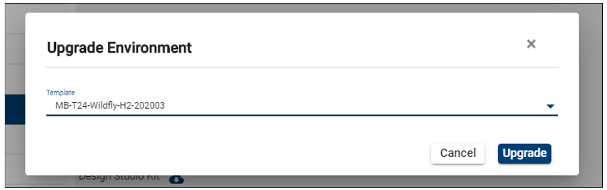
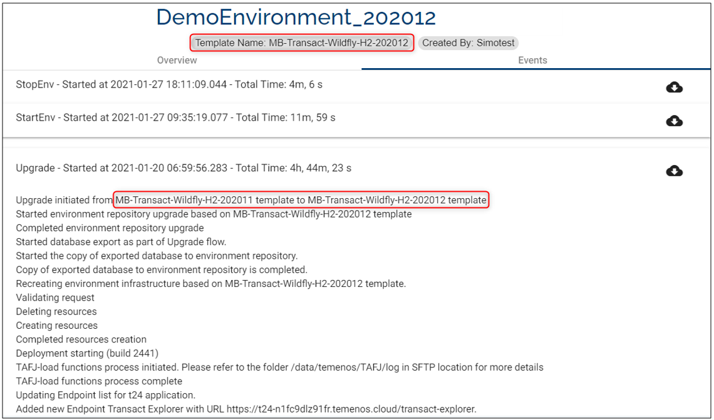

# Upgrade Trials

The **Upgrade** feature enables you to boost your environment to higher T24 releases and run your regression. By undergoing an upgrade you can get better clarity on any issues with the upgrade and in general more confidence and predictability on the upgrade project itself.
 
 
 

# Upgrade pre-requisites #

To upgrade an environment you need:

1. The **UPGRADE_TEMPLATE** user permission enabled​.

2. An environment with the status **STARTED**. ​

3. TortoiseGit installed and configured on your local machine​.

4. ModelBank Templates with the release you intend to upgrade assigned to your organization.

 
 

# How to upgrade an environment #

1. Upon clicking on the button a pop-up appears which prompts to select another template from the list of available template:

 

2. Click on **Upgrade** to proceed.

3. The environment status changes to **Upgrading**:

4. In the **Events** tab you can see the log which refers to the upgrade from the Base template to Target template.

5. Once the action is complete, in the **Template Info** bar you can see that the template name changed to the target release (in this example 202003).

 

 
 

  **Upgrade Validations:**

1. The **Upgrade** button is enabled at the organisation level.

2. Once the **Upgrade** is initiated all the environment action buttons are disabled except **Edit Environment** and **Delete Environment** buttons.
 
3. Only users with the permission **UPGRADE_TEMPLATE** will have the **Upgrade** button enabled on their environment.

4. The **Upgrade** button is not available on a stopped environment.

5. Make sure you have a Database Backup before the upgrade.

6. L3 or other plugins present in the current template are not auto deployed, and you have to upload them back to GIT and deploy it post upgrade.

7. The upgrade pipeline will not deploy anything on the GIT folder to the upgraded environment automatically, therefore you have to manually trigger this post upgrade.

8. The new app server won’t have any additional queues.

9. The upgrade flow is from the client template to ModelBank template and not vice-versa.

10. An environment created with a custom template can be upgraded to a ModelBank template and not vice versa.

11. When an environment is upgraded, the **Clone** and **Rebuild** options are not available.

12. The **Upgrade** functionality is not available for environments resulted from factory runs (automated and manual factories).

13. An environment can only be upgraded with a MB template that is assigned to your organisation. You won't be able to upgrade a MB-T24-Wildfly-H2-202002 to a MB-T24-Wildfly-H2-202004 if the latter version is not assigned to your organisation. 

 
 

 **After the upgrade is completed you can:**

1. **Rebuild** the upgraded environment from the  **Actions** button - a pop-up informs that *Any changes made to the environment will be lost and the environment will be reset to its original state.* To proceed, tick the check box and click **Confirm**:

  

2. **Clone** the upgraded environment from the **Actions** button -  a pop-up appears where you need to insert the **Environment Name**, **Environment Description** and **Labels**. The pop-up informs that if L3 packages are manually altered, then they will not be copied and the clone may not work if the T24 environment is upgraded:

  

3. Use the self-service **Save as New Template** feature (read more here)

4. Use the environment to perform all the environment actions (authorize the exception, deploy, install T24 products updates/ L3/ APIs, COB  etc.).

 
 

Tutorial available [**here**](https://www.youtube.com/watch?v=R4J4P-SlJ6Q&feature=youtu.be).

# User Permissions Required
To be able to perform basic  environment operations the below permissions need to be enabled for your user:

- MANAGE _ ENVIRONMENTS
- CREATE _ ENVIRONMENT
- UPDATE _ ENVIRONMENT
- DELETE _ ENVIRONMENT
- BOOST _ ENVIRONMENT
- REDEPLOY _ ENVIRONMENT
- START _ ENVIRONMENT
- STOP _ ENVIRONMENT
- ALLOW -  EXPORT  - ENVIRONMENT
- START -  ALL  - ENVIRONMENT
- STOP -  ALL  - ENVIRONMENT
- SCHEDULE _ ENVIRONMENT
- ALLOW - EXPORT - ENVIRONMENT
- MANAGE _ ENVIRONMENTS
- UPGRADE_TEMPLATE

To have a better understanding of the user permissions, hover the cursor over the variables and a short description will pop up or click [here](http://documentation.temenos.cloud/home/techguides/user-permissions) to read more.

