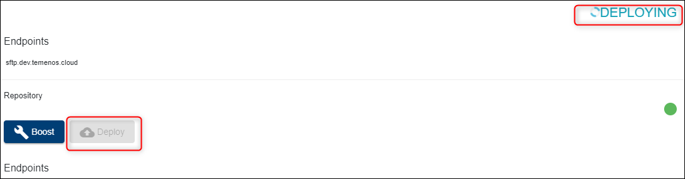

# Introduction #
This document can be used by technical staff who need to deploy different features on a Temenos Continuous Deployment Environment. Each Environment has an associated Repository for uploading different type of features based on the Environment Template type, these features being deployed automatically to your Environment.

Before proceeding, please check the following requirements:
- Make sure you have a GUI Git Client installed in your local machine. This guide uses *TortoiseGit* Git Client that can be installed from <a href="https://tortoisegit.org/download/" target="blank">here</a>.
- Make sure you have an user created under your organisation that has a public ssh key attached. Please check this <a href="./user-creation-in-paas.md" target="blank">guide</a> to understand how you can create an user or how you can generate and attach a ssh key to an user.

# Clone Environment Repository #

•	Please login to your organisation, select your environment and locate the Endpoint of **Repository** Application (this is the last available endpoint on the environment page). 

- Click the **copy to clipboard icon** from the right:

•	Create a folder in any location from your local machine. In the current example, a folder name GitLabRepo is used.

•	Go to your local repository folder(GitLabRepo folder in our example), right click inside the folder and choose **Git Clone**.

•	The bellow screen is opened where you have to paste the Endpoint of **Repository** Application of your Environment in URL textbox, set the Directory textbox to your local repository folder(GitLabRepo folder in our example) and load your private key.

•	Content is downloaded from the Repository of your Environment to your local machine.

# Repository Structure #

The repository structure on your local machine should look like this:

> [!Warning]
> **Do not delete, change or move the environment folder**. This contains the manifest file.

| **Folder**  				| Functionality	|
|-					|-		|
|addons				|	This folder is designed for AppDynamics. Upload files as JAR. |
|client_files\h2db		|	Local H2 database that will be uploaded to the Cloud Environment. Database username must be t24 and password t24 (case sensitive). Database name is mandatory to be “TAFJDB.h2.db” (case sensitive) and must be archived as a ZIP with name TAFJDB.zip (case sensitive). If the above conditions are not satisfied, the database will not be uploaded to the Cloud Environment. This procedure will **replace** the existing database in the cloud with this one. The **old database** will be **lost**, including any records loaded manually.|
|client_files\helptext   | Custom Help Text files can be uploaded in this folder. The file structure must be the same as HELP.TEXT T24 core. Thus, under client_files\helptext folder, the HelpText folder with subfolders for each component (AA, EB, PP, etc.) is expected.   |
|packages				|	One or more T24 DS (Design Studio) packages can be uploaded into this folder. All packages will be deployed automatically inside T24. |
|plugins				|	WAR files can be uploaded in this folder. The files will be deployed inside Jboss EAP. In addition to this, endpoints related to plugins can be automatically added to an application. For more details, check this <a href="./add-app-endpoint.md" target="blank">guide</a>. |
|updates				|	The updates files downloaded from the portal in zip format. The files will be copied to the update folder and the T24 Update procedure is triggered. |
|wsdl				|	WSDL files and folders that are required by plug-ins (war file) need to be uploaded here. |

## Additional folders
The bellow folders are not present as default in environment repository. In any of the bellow functionalities is required, the folder related to that functionality must be first created in environment repository and only after this the functionality of the folder can be used.

| **Folder**  				| Functionality	|
|-					|-		|
|client_files\localjars	|	This folder is designed for local JARs (not released by T24 Core) installation. Any JAR file used by T24 or other parties can be uploaded in this folder. During deployment, all JARs present in this folder will be deployed in the environment. If a JAR file is corrupted or some dependencies are missing, the environment will not start.   |
|client_files\localjars\ext	|	This folder is designed for local JARs installation inside **TAFJ/ext** folder from the environment. |

# Commit & Push features to Repository #
•	Go to repository folder from your local machine(GitLabRepo folder in our example) and copy your file/files (related to your required features that must be deployed to your Environment) to the specific folder/folders based on your requirement. In this guide, an update is pushed to the Environment Repository.

> Important: T24 Updates must be packaged as .zip of .zip file while it is deployed through the Git repository (the parent .zip file name can be anything). Example:
> 
T24-updates.zip
>
&nbsp; &nbsp; &nbsp; |__T24-Updates-2020-X-Y.zip
>
&nbsp; &nbsp; &nbsp; &nbsp; &nbsp; &nbsp; &nbsp; &nbsp; |__ *.Jar

•	To commit the files/files to Environment Repository, right click inside repository folder from your local machine and choose **Git Commit -> "master"...** option.

•	The following screen will appear in which your repository changes can be observed and commited. In order to commit, you have to input a commit message and check the checkbox next to each new file if it is the case.

•	The following screen will appear in which you have to push your changes to Environment Repository. In order to push, click the **Push** button.

•	In the next screen, you have to click **Ok** button.

•	Finally, the status screen for your push action is displayed.

# Trigger Deployment #
•	After all required features are commited and pushed to Environment Repository, you have to deploy these features in your Environment. To do this, login to your organisation, select your environment, locate **Repository** Application and click the **Deploy** button.

•	The Environment and its manageable Applications status will be changed to Deploying during the deployment process and the Deploy button becomes disabled until the deployment is finished.

The logs generated by the deployment process can be also observed in the **Events** tab of your Environment where a new event for *RepositoryDeploy* will be created.

> [!Note]
> The deployment process is triggered **manually** by the user after commiting and pushing all the required features in Environment Repository or whenever is appropiate based on the fact that the user can commit and push features to Environment Repository multiple times and choose when to trigger the deployment.

# Deploy an update to an existing environment #

- Go to your environment and click **Go to Application** in order to log to T24 Browser.

- Sign in with your T24 user and password.

> [!Note]
> First T24 login will take a bit longer.

- In the command line, type TS, BNK/T24.UPDATES and press Go button
- In the new screen, put the service from Stop to **Start** and press **Commit the deal** button on the left. *(This will trigger the deployed updates).*

 - Go back to the portal, click your environment and click **Monitor Application**.
 - Sign in with your user and password. 

- Go to **Execute servlet** under Execution.
- Type the command **START.TSM** and then press **Submit**.
- Go back to T24 browser and in the command line type **SPF S SYSTEM** and press go. 
- In the new screen, scroll down until you see the updates that were added.

