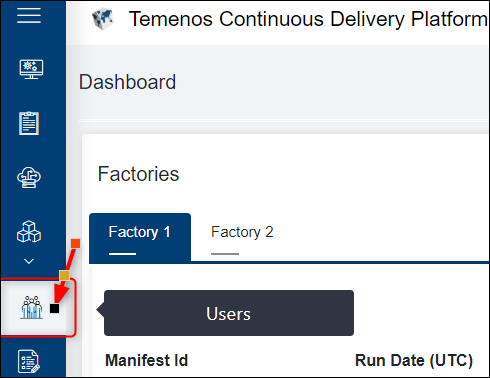
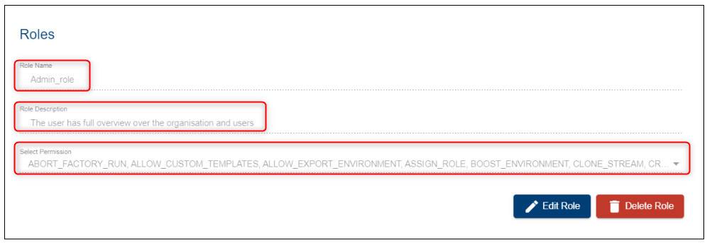
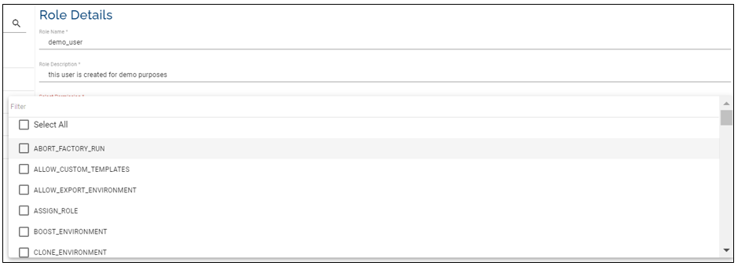
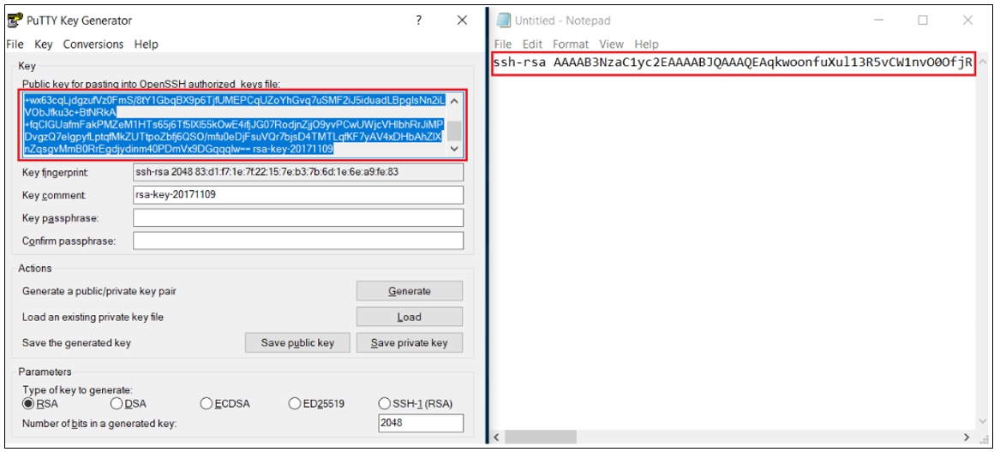
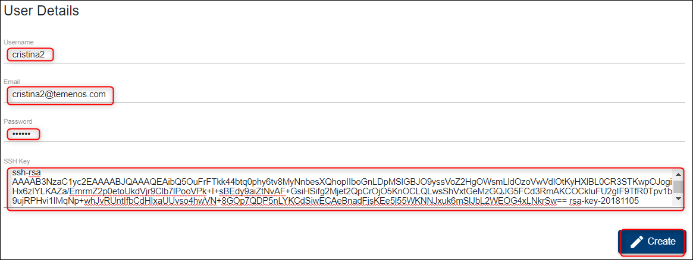
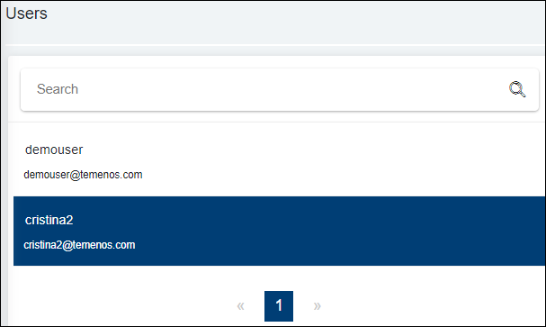

# Introduction #
This document can be used by technical staff who need to create Users on the Temenos Continuous Deployment Platform and associate to each user a ssh key. 

## How to create Users

The Administrator can navigate to the Users section on the portal, create more users and invite them to access and use the portal using the URL link. In this way the administrator is in control of who receives the URL link and which users can access the Organisation.

The users can access their organisation only, view their user profiles and change their password. Note that only the users with the 'Amin' permission can create more users. To create a new user, please refer to the below:

•	Login to your organisation portal using the link and the credentials provided.

•	Go to the menu on the left and then click Users tab, as below:

 

The first screen that you will see is the one for the existing user (usually admin).

Click **New user** button on the top-right corner:

This will create a new user in your organisation. This new user will be automatically assigned to all GitLab Repositories from within all environments. If you have already a user created, you can click on the user and update the SSH key box with the one created above.

# User Roles Management #

By default, when your organisation is created, Temenos will provide you the link and access instructions to your designated organisation administrator (the first and only user with full rights on the platform).

The administrator can create more users and navigate to the Roles section on the portal to assign various permissions to each user. To create a role, the admin will click on 'New Role' and fill in the blanks:

The admin can select which permissions to set to each user.

Once the role is created, the admin can assign it to a specific user:

- go to the 'Users' tab and select the user 
- choose from the drop-down list the user 
- click 'Edit' on the user
- choose from the drop-down list the role that needs to be assigned 

To understand what which of the permission does, hover the cursor over the variables and a short description will pop up or click **[here](http://documentation.temenos.cloud/home/techguides/user-permissions)** to get an overview of the permissions.

# How to use PuTTY SSH client for SSH key generation. #

Should the users requires access to the source code repository they need to provide their public SSH Keys on the user profile section to gain access.

- https://help.github.com/articles/generating-a-new-ssh-key-and-adding-it-to-the-ssh-agent/)

You can use any other SSH key generator client.

> [!Note]
> If you already have installed a SSH key generator client, you can skip this step.

•	Download the installer from [http://www.putty.org/](http://www.putty.org/ "http://www.putty.org/")

•	Run the installer and click **Next** on each screen, without changing anything in configurations. Click **Finish** once completed.

## How to create the SSH keys (pair public and private keys) ##

•	Open PuTTYgen and click Generate button:

•	This creates a new SSH key by moving the mouse in the blank area (highlighted in red), as per bellow picture.

•	After PuTTYgen has finished the key generation, you can save your public key/private key in any location from your local machine.

> [!Note]
> In order to have a valid SSH key that can be recognized by Infrastructure, do not use the Save public key button from PuTTygen and just select the whole public key from the PuTTYgen screen and save it in your local machine.

•	From the PuTTYgen screen you must also save the private key. Press the Save private key button, choose 'Yes' on the next prompt (save the key without a passphrase to protect it) and indicate a name and location for the private key.

•	The public/private key location on your local machine should look like this:

## How to add users on the portal with the SSH keys  ##

> [!Note]
> All fields are mandatory!
> See further below how to generate the SSH key

•	Public SSH key needs to be pasted in SSH Key text box. Open Windows Explorer and locate your public key generated using PuTTY Key Generator. 

• Right click and open it with notepad. Select all and copy to clipboard.

•	Paste the copied text into the SSH Key text box and click Create user button.

- Your user is now available in the user list:

- You have the option to edit or to delete it.

> [!Note]
> Once created, you **cannot** change the name and the email address, nor the user's password. You can only update (or add) the SSH key through edit button.

- Your username will be created in Gitlab server and public SSH key provided will be added to your account being accessible from all the environments created in your organisation.

- For further details or issues related to Gitlab SSH keys usage, or other operating systems (MAC, Linux), please consult this link:  [https://help.github.com/articles/generating-a-new-ssh-key-and-adding-it-to-the-ssh-agent/](

 

# User Roles Required#
To be able to create a user the below permission needs to be enabled for your user:

- CREATE _ USER
